# IPL Data Lineage

## End-to-end flow

```mermaid
flowchart LR
    source[IPL dataset or API] --> ingest[Python ingestion]
    ingest --> rawlake[data/raw immutable files]
    rawlake --> validate[Raw validation]
    validate --> airflow[Airflow orchestration]
    airflow --> raw[Snowflake RAW VARIANT tables]
    raw --> staging[dbt STAGING views]
    staging --> intermediate[dbt INTERMEDIATE tables]
    intermediate --> marts[dbt ANALYTICS marts]
    marts --> quality[dbt tests and freshness]
    quality --> powerbi[Power BI]
    quality --> streamlit[Streamlit]
    terraform[Optional Terraform] -. infrastructure only .-> airflow
```



## Ownership by layer

| Layer | Implementation | Contract |
|---|---|---|
| Source | Configured `IPL_SOURCE_URLS` | External records are retrieved with retries. |
| Ingestion | `ingestion/fetch_ipl_data.py` | Raw response bytes are preserved and timestamped. |
| Local lake | `data/raw/` and `data/processed/` | Raw files are immutable inputs; processed is a future handoff zone. |
| Validation | `ingestion/validate_raw_data.py` | Files exist, contain data, meet configured columns, and have no full duplicates. |
| Orchestration | `airflow/dags/ipl_pipeline_dag.py` | Tasks run in dependency order with retries and hard failure propagation. |
| Snowflake RAW | `snowflake/01_setup.sql` and `ingestion/load_to_snowflake.py` | Source records remain `VARIANT`; file hashes prevent duplicate loads. |
| dbt | `dbt/ipl_analytics/` | JSON extraction, standardization, modeling, documentation, and quality tests. |
| Consumers | `powerbi/` and `streamlit_app/` | Read-only consumption of analytics-ready marts. |
| Infrastructure | `terraform/` | Optional cloud configuration; local filesystem remains the default. |

## Airflow control flow

```text
start
  -> ingest_data
  -> validate_data
  -> load_to_snowflake
  -> dbt_run
  -> dbt_test
  -> pipeline_success
```

The ingestion task owns source retrieval. The validation task raises an Airflow exception when any raw-file check fails. The Snowflake task commits only after all files have loaded successfully. `dbt_run` creates the modeled layers, and `dbt_test` runs source freshness plus schema, relationship, and IPL-specific tests. `pipeline_success` is unreachable after any failure.

## Consumer boundary

Power BI and Streamlit must not parse `RAW_PAYLOAD`, standardize team names, or reproduce dbt calculations. They should use `DIM_*` and `FACT_*` tables documented in [data_dictionary.md](data_dictionary.md). New reusable business logic belongs in dbt, where it can be tested and used by both consumers.